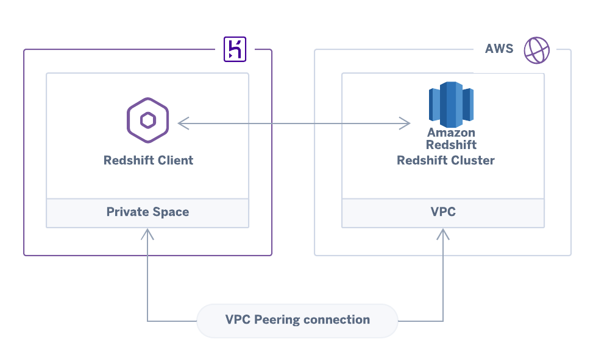

# AWS VPC + Redshift peered with a Heroku Private Space

This example uses Terraform to create:
1. An [AWS VPC](https://github.com/mars/terraform-aws-vpc)
1. A [Redshift Cluster](redshift.tf) in that VPC
1. A [Heroku Private Space peered with that VPC](main.tf)
1. A [`redshift-client`](redshift-client.tf) heroku app deployed to the Private Space

The [redshift-client](https://github.com/trevorscott/redshift-client) Heroku app establishes a connection to Redshift when it starts and outputs success / failure in the Heroku logs.



You can read about this architecture in the Heroku Dev Center article: [Peering Amazon Redshift with Heroku](https://devcenter.heroku.com/articles/peering-aws-rds-aws-redshift-with-heroku).

## Requirements

1. A Heroku Enterprise Account
1. [Git LFS](https://git-lfs.github.com/) 
1. An [AWS IAM](https://console.aws.amazon.com/iam/home) user (`aws_access_key` & `aws_secret_key` in Usage below). 
    With policies:
    * **AmazonVPCFullAccess**
    * **AmazonRedshiftFullAccess**

## Config

You will need to set several enviornment variables to provision both AWS and Heroku resources. 

### Heroku Authorization

Authorization tokens used with Terraform must have *global* scope to perform the various create, read, update, & delete actions on the Heroku API. If you want to isolate Terraform's capabilities from your existing account, then it should be authorized using a separate Heroku account.

First, check your current login to confirm that you're using the account intended for Terraform. If you want to switch identities, logout & then login as intended using the [Heroku CLI](https://devcenter.heroku.com/articles/heroku-cli):

```bash
heroku whoami
heroku logout
heroku login
```

Second, [generate an authorization token](https://devcenter.heroku.com/articles/heroku-cli-commands#heroku-authorizations) using the Heroku CLI. The description is a human-readable name to indicate the purpose or identity of each authorization:

```
heroku authorizations:create --description terraform-my-app
```

Once you have acquired your Heroku authorization token, combine it with your heroku account email, your AWS credentials, the desired Redshift information and save them as [enviornment variables for Terraform](https://www.terraform.io/docs/configuration/variables.html#environment-variables):


```bash
export \
  TF_VAR_heroku_email='your-heroku-email' \
  TF_VAR_heroku_api_key='you-heroku-auth-token' \
  TF_VAR_heroku_enterprise_team='your-enterprise-team-name' \
  TF_VAR_aws_access_key='IAM user aws access key' \
  TF_VAR_aws_secret_key='IAM user aws secret key' \
  TF_VAR_redshift_dbname='alphanumeric and underscores only' \
  TF_VAR_redshift_username='alphanumeric redshift username you would like to create' \
  TF_VAR_redshift_password='master redshift user password' 
```

*Note: `TF_VAR_redshift_username` can only be alphanumeric. `TF_VAR_redshift_dbname` can only be alphanumeric, underscore, or dollar sign.*

## Usage

```bash
terraform init
```

Choose a deployment name. Keep it short as your resources will be prefixed by the chosen name.
```
terraform apply \
  -var name=<your-deployment-name> \
  -var aws_region=us-west-2
```


## Check Connection Health

Once the Terraform apply has completed successfully, there will be two outputs:

```
Outputs:
heroku_app_name = <your heroku app name>
redshift_url = <your redshift cluster database URL>
```

To ensure that your heroku app has successfully connected to redshift, copy / paste your app name into this command:

```
heroku logs -t -a <your heroku app name>
```

You should see 
```
Successfully connected to AWS Redshift Cluster: <your redshift cluster database URL>
```

Alternatively you can run a one off dyno to check the health of the redshift connection:

```
heroku run node redshift-client.js -a <your heroku app name>
```
